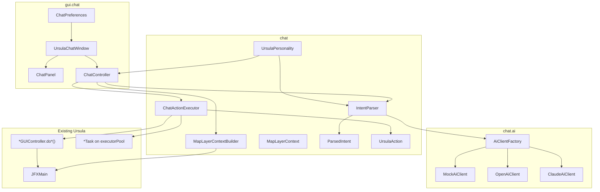

# Ursula Chatbot — Developer Guide

This document explains how the Ursula GIS chatbot works end-to-end so a developer can extend, debug, or wire it to a real LLM.

## Overview

The chatbot is **Ursula**, a female GIS assistant. It:

1. Accepts natural-language input from the user.
2. Sends that text (plus map context) to an **AI client** that returns a structured **intent** (action id + optional target name).
3. **Executes** that intent by calling existing Ursula controllers and background tasks — the same code paths used by menus and layer context menus.

The AI layer is **pluggable**. Today all providers (`Mock`, `ChatGPT`, `Claude`) are **mocked** and use local keyword rules. The architecture is ready for real HTTP calls to OpenAI or Anthropic.

The chat UI lives in a **separate JavaFX `Stage`** (not embedded in the layer panel). It can open at startup or from **Configuración → Asistente Ursula**.

---

## Architecture



---

## Request lifecycle

When the user sends a message (`ChatController.sendMessage()`):

| Step | Thread | What happens |
|------|--------|----------------|
| 1 | JavaFX | User text appended to history; input cleared; send button disabled. |
| 2 | JavaFX | `MapLayerContextBuilder.from(main)` snapshots **loaded map layers** (name, type, active/inactive, entity reference) and the **selected tree item**. |
| 3 | Background (`ursula-chat`) | `AiClientFactory.create(provider)` builds the selected client. |
| 4 | Background | `IntentParser` builds a **system prompt** (Ursula personality + layer list + action catalog) and calls `AiClient.complete(systemPrompt, userMessage)`. |
| 5 | Background | AI response JSON is parsed into `ParsedIntent` (`action`, `targetName`, `confidence`, `message`). |
| 6 | JavaFX (`Platform.runLater`) | `ChatActionExecutor.execute(intent, layerContext)` resolves targets and runs the action. |
| 7 | JavaFX | Reply shown in chat: Ursula's voice message + execution result + debug metadata. |

**Important:** AI parsing runs off the FX thread; **all controller/task calls run on the JavaFX thread** because they open dialogs and touch UI state.

---

## Package layout

```
src/main/java/com/ursulagis/desktop/
├── chat/                          # Domain logic (no JavaFX controls)
│   ├── ai/
│   │   ├── AiClient.java          # Interface: complete(system, user) → AiResponse
│   │   ├── AiClientFactory.java   # MOCK | OPENAI | CLAUDE
│   │   ├── AiProvider.java
│   │   ├── AiResponse.java
│   │   ├── MockAiClient.java      # Keyword rules + JSON intent builder
│   │   ├── OpenAiClient.java      # Mocked; extends MockAiClient
│   │   └── ClaudeAiClient.java    # Mocked; extends MockAiClient
│   ├── ActionContext.java         # Runtime context: main, targetName, layerContext, resolved entities
│   ├── ChatActionExecutor.java    # Intent → controller/task dispatch
│   ├── IntentParser.java          # System prompt + JSON parsing
│   ├── LoadedLayerInfo.java       # One layer snapshot
│   ├── MapLayerContext.java       # Layer list + lookup helpers
│   ├── MapLayerContextBuilder.java# Reads WorldWind + LayerPanel
│   ├── ParsedIntent.java
│   ├── UrsulaAction.java          # Action enum catalog
│   └── UrsulaPersonality.java     # Greeting, voice, i18n strings
│
└── gui/chat/                      # JavaFX UI
    ├── ChatController.java        # Wires panel, sends messages, threading
    ├── ChatPanel.java             # History, input, provider combo, preferences checkbox
    ├── ChatPreferences.java       # showAtStart via java.util.prefs
    └── UrsulaChatWindow.java      # Separate Stage lifecycle
```

---

## UI entry points

### `UrsulaChatWindow`

- Static `show(JFXMain main)` — creates or focuses a non-modal `Stage` (520×420).
- If the window is already open, it is brought to front instead of creating a duplicate.
- On close (`setOnHidden`), the static stage reference is cleared so it can be reopened fresh.

### Startup

In `JFXMain.start()`, after the main window is ready:

```java
if (ChatPreferences.getInstance().isShowAtStart()) {
    PauseTransition chatDelay = new PauseTransition(Duration.millis(1200));
    chatDelay.setOnFinished(e -> UrsulaChatWindow.show(this));
    chatDelay.play();
}
```

### Menu

In `ConfigGUI.contructConfigMenu()`:

```java
addMenuItem(Messages.getString("JFXMain.configChatMI"),
    (a) -> UrsulaChatWindow.show(main), menuConfiguracion);
```

### “Don’t show at startup”

`ChatPanel` has a checkbox bound to `ChatPreferences.setShowAtStart(!selected)`.

Persistence: `Preferences.userRoot().node("com/ursulagis/desktop/chat")`, key `showAtStart` (default `true`).

---

## AI layer

### `AiClient` contract

```java
AiResponse complete(String systemPrompt, String userPrompt);
```

### Expected AI output (JSON only)

The parser uses regex (not a full JSON library). The model must return **only** this shape:

```json
{
  "action": "RESUMIR_LABOR",
  "targetName": "Lote Norte",
  "confidence": 0.9,
  "message": "¡Dale! Voy a resumir esa capa."
}
```

| Field | Required | Description |
|-------|----------|-------------|
| `action` | Yes | Must match an `UrsulaAction` enum name (e.g. `IMPORT_COSECHA`). |
| `targetName` | No | Layer or entity name when the action needs a specific capa. |
| `confidence` | No | 0.0–1.0 (defaults to 0.5 if missing). |
| `message` | No | Ursula’s spoken reply; shown to the user. |

### System prompt contents (`IntentParser.buildSystemPrompt()`)

1. **Personality** from `UrsulaPersonality.systemPromptPreamble()` (i18n).
2. Instruction to respond with JSON only.
3. **Loaded layers** from `MapLayerContext.toPromptSection()` — each layer with name, type, activa/inactiva, and selected tree item.
4. Full **action catalog** from `UrsulaAction` (id + English description).

### Providers

| Provider | Class | Current behavior |
|----------|-------|------------------|
| `MOCK` | `MockAiClient` | Keyword matching on user text; builds JSON locally. |
| `OPENAI` | `OpenAiClient` | Logs a fake API call; delegates to `MockAiClient.parseIntent()`. |
| `CLAUDE` | `ClaudeAiClient` | Same as OpenAI mock. |

### Wiring a real LLM

Replace the body of `OpenAiClient.complete()` or `ClaudeAiClient.complete()`:

1. POST to the provider API with `systemPrompt` and `userPrompt`.
2. Extract the assistant message text from the response.
3. Return `new AiResponse(content, modelName, provider, latencyMs, false)`.

`IntentParser.parseJson()` will parse the content as long as it contains the expected JSON fields.

`MockAiClient` is the reference for keyword → action mapping during development without API keys.

---

## Action execution

### `UrsulaAction` catalog

Each enum value has flags:

- `requiresLabor` — needs a `Labor<?>` on the map.
- `requiresCosecha` — labor must be `CosechaLabor`.
- `requiresRecorrida` — needs a `Recorrida` on the map.

| Action | Needs target | Delegates to |
|--------|--------------|--------------|
| `HELP` | No | Static help text + layer list |
| `LIST_LAYERS` | No | `MapLayerContext.formatLayerList()` |
| `IMPORT_COSECHA` | No | `cosechaGUIController.doOpenCosecha(null)` |
| `IMPORT_COSECHA_VOYAGER` | No | `doOpenCosechaVoyager()` |
| `IMPORT_RECORRIDA` | No | `recorridaGUIController.doOpenRecorridaMap(null)` |
| `IMPORT_NDVI` | No | `ndviGUIController.doOpenNDVITiffFiles()` |
| `IMPORT_SUELO` | No | `sueloGUIController.doOpenSoilMap(null)` |
| `BULK_NDVI_DOWNLOAD` | No | `ndviGUIController.doBulkNDVIDownload()` |
| `BALANCE_NUTRIENTES` | No | `sueloGUIController.doProcesarBalanceNutrientes()` |
| `JUNTAR_SHAPES` | No | `genericGUIController.doJuntarShapefiles()` |
| `MEDIR_DISTANCIA` | No | `poligonoGUIController.doMedirDistancia()` |
| `CREAR_POLIGONO` | No | `poligonoGUIController.doCrearPoligono()` |
| `SHOW_LABORES_TABLE` | No | `configGUIController.doShowLaboresTable()` |
| `GO_TO_LAYER` | Labor | `main.viewGoTo(labor)` |
| `RESUMIR_LABOR` | Labor (active) | `ResumirLaborMapTask` |
| `EXPORT_LABOR` | Labor | `ExportLaborMapTask` |
| `CLONAR_LABOR` | Labor | `ClonarLaborMapTask` |
| `DOWNLOAD_NDVI` | Labor | `ndviGUIController.doGetNdviTiffFile(labor)` |
| `COMPARTIR_COSECHA` | CosechaLabor | `cosechaGUIController.doCompartirCosecha()` |
| `UPDATE_RECORRIDA` | Recorrida | `recorridaGUIController.doUpdateRecorrida()` |
| `EXPORT_RECORRIDA` | Recorrida | `recorridaGUIController.doExportRecorrida()` |
| `UNKNOWN` | No | Returns AI `message` only; no side effect |

**Design rule:** Prefer calling existing `do*` methods on controllers rather than instantiating `*Task` directly — unless the chat needs the same low-level path as a layer action (e.g. `RESUMIR_LABOR` mirrors `GenericLaborGUIController`).

---

## Map layer context

The bot does **not** query the database (`DAH`) for layer-targeted actions. It only considers entities **currently loaded on the WorldWind map**.

### How layers are discovered

`MapLayerContextBuilder.from(main)` iterates `main.getWwd().getModel().getLayers()` and keeps layers where:

- `layer.getValue(Labor.LABOR_LAYER_IDENTIFICATOR)` is non-null.
- Layer name is not a WorldWind base layer (stars, compass, bing imagery, etc.).

Each entry becomes `LoadedLayerInfo(name, type, active, entity)` where `active = layer.isEnabled()` (checkbox in layer tree).

### Selected layer

`LayerPanel.getSelectedLayer()` returns the tree selection; its name is included in the AI prompt as `Selected in layer tree: ...`.

### Target resolution order (`ChatActionExecutor`)

For labor-based actions:

1. **Explicit name** — `targetName` from intent, matched against loaded layers (exact, then partial; prefers active on ambiguity).
2. **Tree selection** — selected layer if it matches the required type.
3. **Single active layer** — if exactly one active labor (or cosecha) is loaded.
4. **Single loaded layer** — if only one of that type exists.

For recorrida actions: same pattern using `Recorrida` entities on the map.

If multiple layers match, the executor returns a message listing options instead of guessing.

### Prompt section example

```
Loaded map layers:
- Lote Norte (CosechaLabor, activa)
- Recorrida 2024 (Recorrida, inactiva) [selected in tree]
Active layers: Lote Norte
Selected in layer tree: Recorrida 2024
When the user refers to "active layer" or "capa activa", use an active layer name as targetName.
```

`MockAiClient` also resolves `"capa activa"` by reading `Active layers:` from the system prompt.

---

## Personality and i18n

`UrsulaPersonality` centralizes user-facing voice strings via `Messages.getString()`:

| Key | Usage |
|-----|--------|
| `Chat.greeting` | Welcome when window opens |
| `Chat.personalitySystem` | LLM system prompt personality block |
| `Chat.roleUrsula` | Message label in history |
| `Chat.helpIntro` | HELP action intro |
| `Chat.unknownReply` | UNKNOWN fallback voice |

Strings live in `gui/messages_es.properties`, `messages_en.properties`, `messages_fr.properties`, `messages_pt.properties`.

Other UI keys: `Chat.send`, `Chat.dontShowAtStart`, `Chat.statusThinking`, `JFXMain.configChatMI`, etc.

---

## Adding a new action

1. **Add enum** — `UrsulaAction.NEW_ACTION` with correct `requiresLabor` / `requiresCosecha` / `requiresRecorrida` flags and description.

2. **Dispatch** — Add a `case` in `ChatActionExecutor.execute()` that calls the appropriate `main.*GUIController.do*()` or task.

3. **Mock keywords** — Add a branch in `MockAiClient.parseIntent()` with example phrases and an Ursula-voice `message`.

4. **i18n** (optional) — Add mock message keys if you move phrases to properties.

5. **Test** — Open chat, try the phrase, confirm JSON action name and execution on FX thread.

The action catalog in the system prompt is built automatically from `UrsulaAction.values()`, so new enum entries appear in the LLM prompt without extra registration.

---

## Debugging

Each reply appends metadata (useful during development):

```
[acción: IMPORT_COSECHA, confianza: 95%, Mock (local), 187ms]
```

- **Wrong action** — Check `MockAiClient` keyword order (first match wins) or LLM JSON `action` field.
- **“No encontré la capa”** — Layer not loaded on map, name mismatch, or multiple ambiguous matches. Use `LIST_LAYERS` or `capas cargadas`.
- **Dialog doesn’t open** — Ensure execution runs on JavaFX thread (`Platform.runLater` in `ChatController`).
- **Inactive layer** — `RESUMIR_LABOR` requires the target layer to be **active** (`isEnabled()`).

---

## Dependencies and conventions

- **JavaFX** — UI only in `gui.chat`; core logic in `chat` has no control imports (except `UrsulaPersonality` → `Messages`).
- **WorldWind** — Layer identity via `Labor.LABOR_LAYER_IDENTIFICATOR` on `gov.nasa.worldwind.layers.Layer`.
- **Threading** — Background for AI; FX for all Ursula side effects.
- **Preferences** — Same pattern as `OnboardingAchievements` (`showAtStart`).

---

## Quick reference: class responsibilities

| Class | Responsibility |
|-------|----------------|
| `UrsulaChatWindow` | Stage lifecycle, open/focus window |
| `ChatPanel` | Visual layout, history, input, provider selector |
| `ChatController` | User events, threading, welcome message, reply formatting |
| `ChatPreferences` | Persist startup visibility |
| `MapLayerContextBuilder` | Snapshot map + tree into `MapLayerContext` |
| `MapLayerContext` | Layer lookup, prompt text, list formatting |
| `IntentParser` | Build system prompt, call AI, parse JSON |
| `ParsedIntent` | Structured result of parsing |
| `ChatActionExecutor` | Resolve entities, run Ursula actions |
| `ActionContext` | Per-request state (main, layers, labor, cosecha, recorrida) |
| `UrsulaAction` | Canonical action ids |
| `UrsulaPersonality` | Greeting and voice strings |
| `AiClient` / `MockAiClient` | Natural language → JSON intent |
